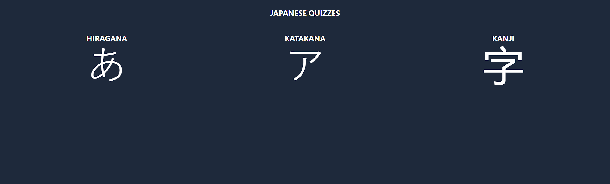

[Readme español](README.es.md)

# Japanese Quiz App

An interactive web application for learning Japanese through quizzes. This application is built with React and utilizes Tailwind CSS for modern and responsive styles.

## Features

- Real-time scoring with maximum score tracking.
- Responsive design for an optimal experience on both mobile and desktop devices.

## Screenshots



## # Installation

1. Clone this repository:

```bash
git clone https://github.com/tu-usuario/japanese-quiz-app.git
```

2. Navigate to the project directory: `cd japanese-quiz`

3. Install dependencies: `npm install`

4. Start the application: `npm start`

5. Open your browser and visit `http://localhost:3000` to view the application.

#### Contributing

Contributions are welcome! If you have ideas for new features, code improvements, or encounter issues, please create an issue or submit a pull request.
